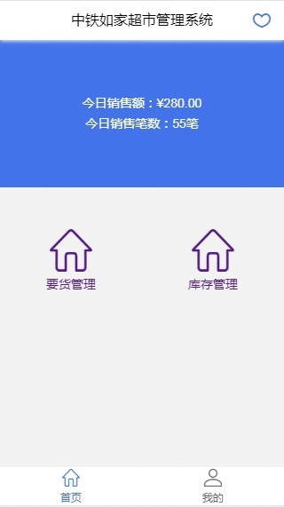

# wangpq-vue-market-demo
> 使用Vue-cli脚手架构建的一个简单的Vue单页应用示例，旨在演示。使用到的技术，less书写样式，vue-router管理路由,mock模拟数据，better-scroll下拉刷新，上拉到底部加载更多。封装了个简单的页面容器组件common-page.vue，可以左右动画加载页面，popview组件可以让页面以自己设定的动画方式出现页面对话框。组件在命名上比较随意，是告诉我们其实名称可以多种，个人建议中划线-的方式。

## 部分页面介绍

我的要货单页

mock模拟ajax数据，并使用自个基于better-scroll编写的组件scroll-view实现下拉刷新，上拉到底部加载更多。


要货单列表页

点击要货单列表页头部右侧铅笔图标，将从下至上弹出编辑页面，动画方式可自己设定。
另外，为了实现安卓手机物理返回键监测弹框取消，使用了H5的pushState。先定义了一个函数pushHistory，然后在弹框出现的时候调用pushHistory。具体使用请查看代码。

``` bash
export function pushHistory(title) {
  if (window.history && window.history.pushState) {
    const state = {
      title: title,
      url: window.location.href
    }
    window.history.pushState(state,title,window.location.href); 
  }
}

pushHistory("pop-view-"+"manage");
```

## 如何运行此示例

``` bash
# npm下载依赖
npm install

# 本地调试运行
npm run dev

# 生产打包
npm run build

# build for production and view the bundle analyzer report
npm run build --report
```

## 运行效果

